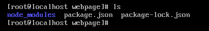
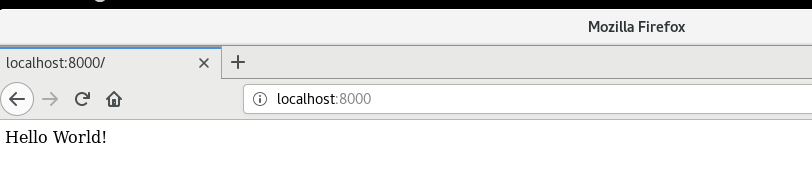

# Operating Systems 1 Final Project: Setting up PERN
This tutorial will show you how to set up PERN (PostgreSQL, Express, React, and Node.js) on a Fedora Linux machine. 
By following this tutorial, you should be able to host a webpage from your Fedora Linux Machine. This tutorial is based on a Fedora 28 virtual machine and will not install React.
## Required Installations
#### PostgreSQL
You can install PostgreSQL by running the following dnf install (as root, or add sudo to the beginning if you need to):
```
dnf install postgresql
```
Type 'y' when asked if you wish to install. Below is an example output of the install:


#### Node.js
Install node by entering the following command:
```
dnf install nodejs
```
You can confirm the download executed properly by executing the following command:
``
node -v
``
Example Output:


## PostgreSQL on Startup
Now that everything is installed, we need to make sure that Node and PostgreSQL are configured to start upon startup of the machine.The next commands will start the postgresql daemon, then configure them to start at boot. Run these commands:
```
systemctl start postgresql 
systemctl enable postgresql
```
## Create the Page
Now that we have installed everything required for a page to run, we need to create the page by creating a folder, initalizing it, then creating a js file to host the webpage.

Run the following command to make a directory called webpage and initialize it for the files:
```
mkdir webpage
cd webpage
npm init
```
After you run the init command, push enter through all of the prompts to use the default settings. Then type yes to confirm initialization.
#### Install Express
Install Express in this folder, which will add more needed files by running the following command in the directory of the folder:
```
npm i express - save
```
At this point, you directory should look like this:

#### Create Index File
Create the index file with the following command:
```
touch website.js
```
Now, insert the following code using a text editor for a sample "Hello World" javascript webpage:
```
const express = require("express");
const path = require("path");

const app = express();
const port = process.env.PORT || "8000";

app.get("/", (req, res) => {
  res.status(200).send("WHATABYTE: Food For Devs");
});

app.listen(port, () => {
  console.log(`Listening to requests on http://localhost:${port}`);
});
```
At this point, if you wish to test and see if your code is running, you can save and exit the editor, run the "node webpage.js" command, then open up firefox to view the webpage. If it runs properly, congrats! You are serving a webpage!

Example:
```
node webpage.js
```

## Run on Startup
The way that we will show you to run this web page on startup in your fedora linux is by configuring a script to run on startup. In a directory of your choice (example will use root home directory)
```
touch webstart.sh
```
Using a text editor, put a line in the file to start the webpage:
```
node /root/webpage/webpage.js
```
Open up the crontab file using the following command:
```
crontab -e
```
Edit the file and add the following lines:
```
@reboot /usr/local/bin/forever start /root/webpage/webpage.js else
@reboot sh /root/webstart.sh
```
