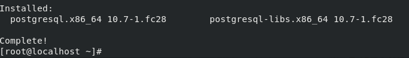
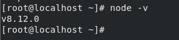

# Operating Systems 1 Final Project: Setting up PERN
This tutorial will show you how to set up PERN (PostgreSQL, Express, React, and Node.js) on a Fedora Linux machine. 
By following this tutorial, you should be able to host a webpage from your Fedora Linux Machine. This tutorial is based on a Fedora 28 virtual machine and will not install React.
## Required Installations
#### PostgreSQL
You can install PostgreSQL by running the following dnf install (as root, or add sudo to the beginning if you need to):
```
dnf install postgresql
```
Type 'y' when asked if you wish to install. Below is an example output of the install:



#### Node.js
Install node by entering the following command:
```
dnf install nodejs
```
You can confirm the download executed properly by executing the following command:
``
node -v
``
Example Output:


#### Express
Install Express by using the following command:
```
npm install express --save
```
## Configure to Startup
Now that everything is installed, we need to make sure that Node and PostgreSQL are configured to start upon startup of the machine.The next commands will both start the daemons, then configure them to start at boot. Run these commands:
```
systemctl start postgresql ; systemctl enable postgresql
```
```
systemctl start 
```